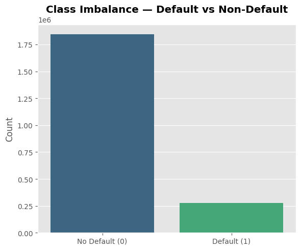
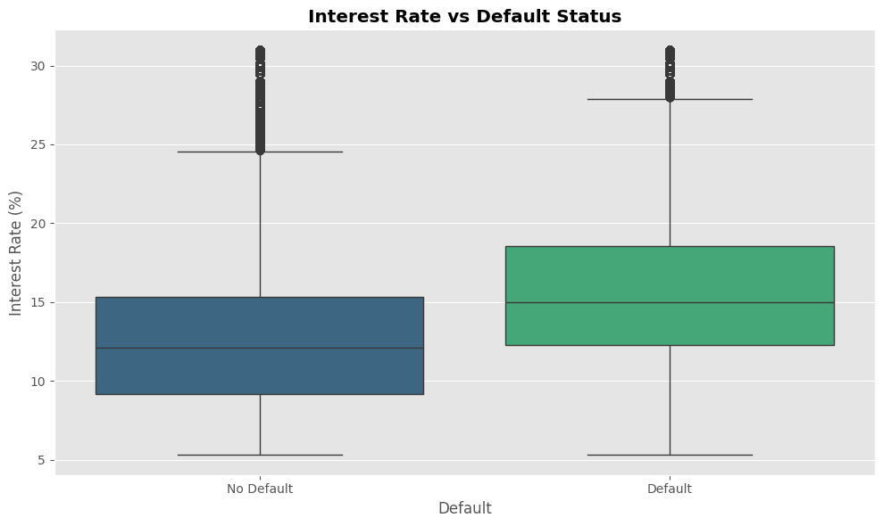

# Credit Scoring & Expected Loss - Lending Club


[](https://github.com/sergioiglesias1/credit-risk-modeling/actions/workflows/ci.yml)
[](https://github.com/astral-sh/ruff)


Credit risk pipeline on Lending Club 36-month loans. A PD model and an LGD model are combined into the expected loss of each loan, validated out of time on a vintage the models never saw, and served through a small FastAPI app.

> `EL = PD × LGD × EAD`

---
### 👉 [Live Demo Here](https://credit-risk-scoring.onrender.com)
---

> The app runs on Render's free tier: after 15 minutes without traffic it sleeps, so the first request can take up to a minute.

## Project Overview

- **Data preparation** (`app/data.py`): targets are built from the payment columns, which are then excluded from the features. Only 36-month loans from vintages that had fully run off are used, so every label is final.
- **PD model**: binary classification of default, trained with balanced class weights and recalibrated so its probabilities match observed default rates.
- **LGD model**: regression on charged-off loans, `LGD = 1 - recoveries / EAD at default`, bounded to [0, 1].
- **Expected loss**: `EAD = CCF × funded amount`, with the CCF estimated on training defaults, then backtested against the loss actually realized.
- **Decision**: approve when the expected margin beats the expected loss, `(1 - PD) × m > PD × LGD × CCF`, with the margin `m` as an explicit parameter.

## Validation Design

| Split | Issued | Use |
| --- | --- | --- |
| Train | 2007-06 to 2014-06 | Model fitting |
| Validation | 2014-07 to 2014-12 | Tuning, probability calibration, threshold |
| Test | 2015 | Reported once |

Loans still being repaid in the raw data would count as non-defaults, which makes recent vintages look safe. That is why the split is by issue date and stops at 2015, the last vintage of 36-month loans that had fully run off. 60-month loans are left out: they never run off inside the data, so they cannot be tested out of time.

## Results

| Metric | Value |
| --- | --- |
| PD model | LightGBM, 15 application-time features |
| Test AUC / Gini / KS | 0.686 / 0.372 / 0.270 |
| Test AUC, full 20-feature model | 0.688 |
| Test AUC, Lending Club sub-grade alone | 0.678 |
| Default rate 2015, observed / predicted | 14.9% / 12.9% |
| LGD model, test MAE / R² | LightGBM, 0.097 / 0.000 |
| Expected loss, 2015 portfolio | $222.7M (6.15%) |
| Realized loss, 2015 portfolio | $267.4M (7.38%) |
| Approval threshold (margin 10%) | PD < 16.4% |

| Margin | Threshold t* | Approval rate | Bad rate, approved | Defaults rejected |
| --- | --- | --- | --- | --- |
| 5.0% | 8.9% | 39.0% | 7.0% | 81.8% |
| 10.0% | 16.4% | 71.4% | 10.5% | 49.6% |
| 15.5% | 23.3% | 88.1% | 12.8% | 24.4% |

_Values from `models/metrics.json` (trained 2026-09-27). The live page always reads the current file._

- The deployed model uses 15 fields known at application time, so the scoring form matches the model exactly. The 5 extra fields of the full model barely change AUC.
- Lending Club's own sub-grade, used alone as a score, is almost as good as the model (see the table): most of the signal is already in their pricing. This dataset has no FICO score, the strongest predictor they priced on.
- 2015 defaulted more than the vintages used for calibration, so PDs and expected loss come out below what was realized. The backtest by PD decile on the live page shows where.
- LGD barely varies with application data (R² close to 0): recoveries on these loans are low for almost every borrower.

## Exploratory Analysis

From the exploratory notebook, on the whole dataset before the modelling filters.

<p>
  
  
</p>

Correlation matrix and feature distributions: [corr_matrix.png](viz/corr_matrix.png), [boxplots_without_IQR.png](viz/boxplots_without_IQR.png), [boxplots_with_IQR.png](viz/boxplots_with_IQR.png).

## API

```bash
curl -X POST https://credit-risk-scoring.onrender.com/predict \
  -H "Content-Type: application/json" \
  -d '{"funded_amnt": 12000, "interest_rate": 12.5, "grade": "B4", "annual_income": 65000,
       "dti": 17, "emp_length_years": 6, "home_ownership": "MORTGAGE",
       "verification_status": "Source Verified", "loan_purpose": "debt_consolidation",
       "delinq_2yrs": 0, "inquiries_6m": 0, "open_credit_lines": 11,
       "revolving_balance": 11000, "revolving_utilization": 50, "credit_history_years": 15}'
```

Returns PD, LGD, EAD, expected loss and the approve/reject decision. Invalid inputs return `422` with the failing fields. Full schema at `/docs`.

## Dataset

The dataset is not included due to size constraints. Download the Lending Club loan data from Kaggle and place `X.csv` and `target.csv` in `data/`.

## File Structure
```
.
├── .github/workflows/ci.yml    # ruff + pytest on every push
├── app/
│   ├── main.py                 # FastAPI: results page and POST /predict
│   ├── schemas.py              # request validation
│   ├── config.py               # paths, split dates, features, margin
│   ├── data.py                 # targets, features and out-of-time split
│   ├── modeling.py             # PD and LGD trainers (sklearn pipelines)
│   ├── utils.py                # metrics, threshold analysis, expected loss
│   ├── plots.py                # charts for the results page
│   ├── train.py                # training entry point
│   ├── templates/index.html
│   └── static/                 # CSS, form script and the generated charts
├── models/                     # pd_model.joblib, lgd_model.joblib, metrics.json
├── tests/test_api.py
├── viz/                        # exploratory figures
├── ETL.ipynb                   # data quality, feature engineering & risk analysis
├── render.yaml
└── requirements.txt
```

## How to Run

### 1. Install dependencies
```bash
pip install -r requirements.txt
pip install pyarrow matplotlib    # only needed to retrain
```

### 2. Prepare the data
```bash
python -m app.data
```
Builds `data/processed.parquet` from `data/X.csv` and `data/target.csv`.

### 3. Train the models
```bash
python -m app.train
```
Trains PD and LGD, saves them to `models/`, writes `models/metrics.json` and the charts in `app/static/figures/`. The results page reads every figure from `metrics.json`.

### 4. Run the app
```bash
uvicorn app.main:app --reload
```
Open http://127.0.0.1:8000. Tests: `pip install pytest httpx && pytest`.

## Deployment

Render native Python web service, configured in `render.yaml`: build with `pip install -r requirements.txt`, start with `uvicorn app.main:app --host 0.0.0.0 --port $PORT`. The trained models are committed, so the service does not need the dataset.

## License

MIT License
